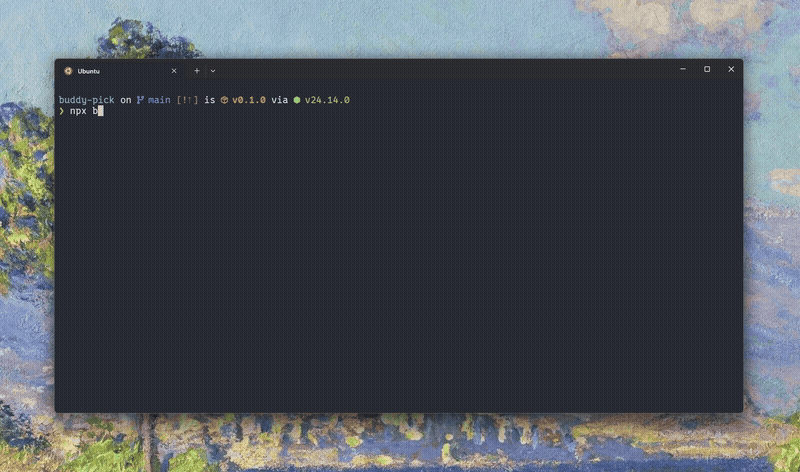

# buddy-pick

> Choose your own Claude Code `/buddy` companion.

<p align="center">
  
</p>

**buddy-pick** is an interactive CLI that lets you preview, search, and pick the exact `/buddy` companion you want in Claude Code — then patches the binary to make it happen.

```
npx buddy-pick
```

---

## Features

### Browse Species Gallery

View all 18 species ASCII art side-by-side with eye styles, hat types, and rarity tiers — directly in your terminal.

### Bruteforce Search

Filter by **species**, **rarity**, **eyes**, **hat**, and **shiny** status. buddy-pick iterates candidate salts at thousands per second (via a bun subprocess for hash accuracy) and finds the perfect companion for you.

### Claudex

Your personal companion collection. Every patched buddy is automatically saved to the Claudex (`~/.config/buddy-pick/claudex.json`). When a Claude Code update overwrites your binary, open the Claudex and re-apply any saved companion with one click — no bruteforcing needed. You can also preview, rename, or delete entries.

### Rename Companion

Change your companion's name without modifying the binary. Writes directly to `~/.claude.json` — takes effect immediately, no restart needed.

### Preview Custom Salt

Enter any 15-character salt and instantly see what companion it would produce — species, rarity, stats, hat, eyes, and shiny status — all rendered in a boxed card with stat bars.

### Restore from Backup

One-click restore to the original binary from the `.buddy-pick.bak` backup.

---

## Species

All 18 companion species, rendered in ASCII:

```
Duck              Goose             Blob
    __                 (·>             .----.
  <(· )___             ||             ( ·  · )
   (  ._>            _(__)_           (      )
    `--´              ^^^^             `----´

Cat               Dragon            Octopus
   /\_/\            /^\  /^\           .----.
  ( ·   ·)         <  ·  ·  >         ( ·  · )
  (  ω  )          (   ~~   )         (______)
  (")_(")           `-vvvv-´          /\/\/\/\

Owl               Penguin           Turtle
   /\  /\           .---.              _,--._
  ((·)(·))          (·>·)             ( ·  · )
  (  ><  )         /(   )\           /[______]\
   `----´           `---´             ``    ``

Snail             Ghost             Axolotl
 ·    .--.           .----.         }~(______)~{
  \  ( @ )          / ·  · \        }~(· .. ·)~{
   \_`--´           |      |          ( .--. )
  ~~~~~~~           ~`~``~`~          (_/  \_)

Capybara          Cactus            Robot
  n______n         n  ____  n          .[||].
 ( ·    · )        | |·  ·| |         [ ·  · ]
 (   oo   )        |_|    |_|         [ ==== ]
  `------´           |    |           `------´

Rabbit            Mushroom          Chonk
   (\__/)          .-o-OO-o-.         /\    /\
  ( ·  · )        (__________)       ( ·    · )
 =(  ..  )=          |·  ·|          (   ..   )
  (")__(")           |____|           `------´
```

## Hats

Non-common companions can wear one of 7 hats:

```
crown           tophat          propeller       halo
   \^^^/           [___]            -+-            (   )
   .----.          .----.          .----.          .----.
  ( ·  · )        ( ·  · )        ( ·  · )        ( ·  · )
  (      )        (      )        (      )        (      )
   `----´          `----´          `----´          `----´

wizard          beanie          tinyduck
    /^\            (___)            ,>
   .----.          .----.          .----.
  ( ·  · )        ( ·  · )        ( ·  · )
  (      )        (      )        (      )
   `----´          `----´          `----´
```

## Eyes

Six eye styles: `·` `✦` `×` `◉` `@` `°`

## Rarity

| Rarity    | Stars | Chance | Stat Floor |
| --------- | ----- | ------ | ---------- |
| Common    | ★     | 60%    | 5          |
| Uncommon  | ★★    | 25%    | 15         |
| Rare      | ★★★   | 10%    | 25         |
| Epic      | ★★★★  | 4%     | 35         |
| Legendary | ★★★★★ | 1%     | 50         |

Plus a **1% shiny** chance on any rarity.

---

## How It Works

Claude Code generates companions deterministically:

```
userId + SALT ─→ wyhash ─→ mulberry32 PRNG ─→ rarity ─→ species ─→ eyes ─→ hat ─→ shiny ─→ stats
```

The **SALT** is a 15-byte string baked into the Claude binary. Same user + same salt = same companion, every time. buddy-pick finds the salt using a nearby immutable constant as a structural anchor, previews what different salts produce, and patches the binary when you've found your match.

### Why a bun subprocess?

The production binary uses `Bun.hash()` (wyhash). No npm package produces matching output — we tested `wyhash` (v1.0.0) and `xxhash-wasm`, both differ. So buddy-pick spawns a long-lived bun process and pipes hash requests through stdin/stdout. Falls back to FNV-1a with a warning if bun isn't available.

---

## Requirements

- **Claude Code >= 2.1.89** (buddy system introduced in this version)
- **Node.js >= 18**
- **Bun** (recommended — auto-detected for accurate hash computation)

## Limitations

- **Auto-updates overwrite patches** — Claude Code updates replace the binary. Re-run buddy-pick to re-apply. Your backup is preserved.
- **Hash accuracy requires bun** — Without bun, previews use FNV-1a and may not match production.
- **Restart needed after patching** — The running Claude Code instance loads the binary at startup. Restart it after patching to see your new companion.

## License

MIT
